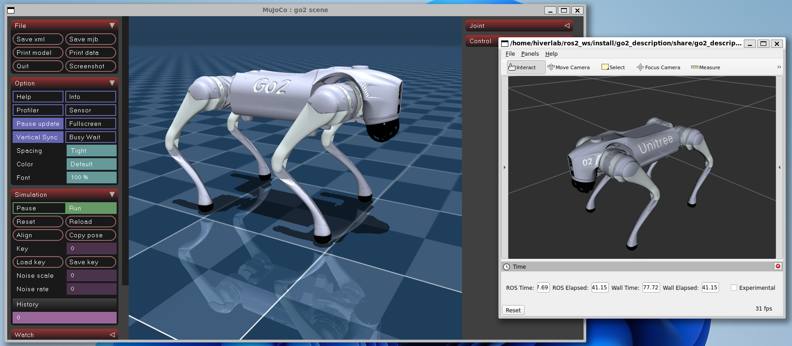
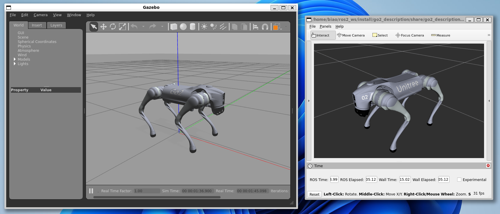
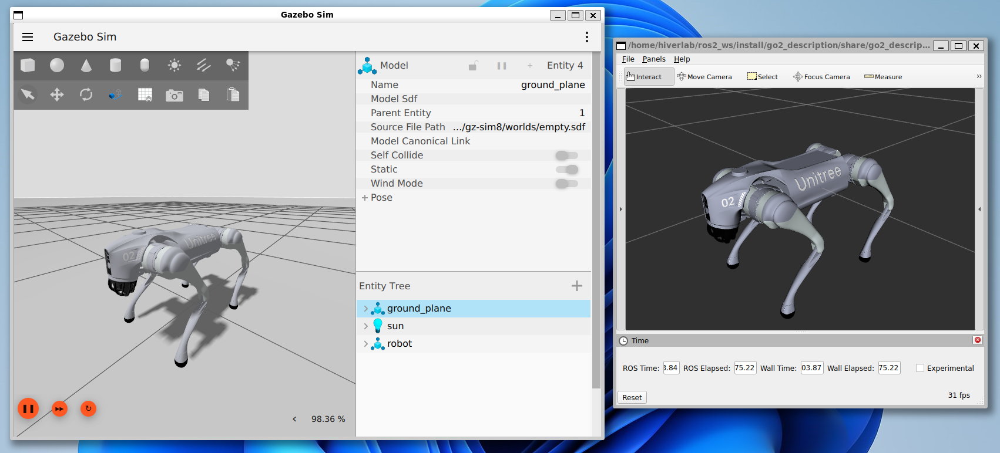

# Quadruped ROS2 Control

**ROS2 Humble Branch**

This repository contains the ros2-control based controllers for the quadruped robot.

* [Controllers](controllers): contains the ros2-control controllers
* [Commands](commands): contains command node used to send command to the controller
* [Descriptions](descriptions): contains the urdf model of the robot
* [Hardwares](hardwares): contains the ros2-control hardware interface for the robot

Todo List:

- [x] **[2025-02-23]** Add Gazebo Playground
  - [x] OCS2 controller for Gazebo Simulation
  - [x] Refactor FSM and Sysu219 Guide Controller
- [x] **[2025-03-30]** Add Real Sysu219 Robot Support
- [ ] OCS2 Perceptive locomotion demo

Video on Real Sysu219 Robot:
[](https://www.bilibili.com/video/BV1QpZaY8EYV/)

## 1. Quick Start

* rosdep
    ```bash
    cd ~/ros2_ws
    rosdep install --from-paths src --ignore-src -r -y
    ```
* Compile the package
    ```bash
    colcon build --packages-up-to sysu219_guide_controller sysu219_description keyboard_input --symlink-install
    ```

### 1.1 Mujoco Simulator or Real Sysu219 Robot
> **Warning:** CycloneDDS ROS2 RMW may conflict with unitree_sdk2. If you cannot launch the Mujoco simulation
> without `sudo`, then you cannot use the hardware_sysu219 interface. This conflict could be solved by one of below two
> methods:
> 1. Uninstall CycloneDDS ROS2 RMW, used another ROS2 RMW, such as FastDDS **[Recommended]**.
> 2. Follow the guide in [unitree_ros2](https://github.com/unitreerobotics/unitree_ros2) to configure the ROS2 RMW by
     compiling cyclone dds.

* Compile Sysu219 Hardware Interfaces
    ```bash
    cd ~/ros2_ws
    colcon build --packages-up-to hardware_sysu219
    ```
* Launch the Mujoco simulation environment
* Launch the ros2-control
    ```bash
    source ~/ros2_ws/install/setup.bash
    ros2 launch sysu219_guide_controller mujoco.launch.py
    ```
* Run the keyboard control node
    ```bash
    source ~/ros2_ws/install/setup.bash
    ros2 run keyboard_input keyboard_input
    ```



### 1.2 Gazebo Classic Simulator (ROS2 Humble)

* Install Gazebo Classic
  ```bash
  sudo apt-get install ros-humble-gazebo-ros ros-humble-gazebo-ros2-control
  ```
* Compile Leg PD Controller
    ```bash
    colcon build --packages-up-to leg_pd_controller
    ```
* Launch the ros2-control
    ```bash
    source ~/ros2_ws/install/setup.bash
    ros2 launch sysu219_guide_controller robot_hardware.launch.py
    ```
* Run the keyboard control node
    ```bash
    source ~/ros2_ws/install/setup.bash
    ros2 run keyboard_input keyboard_input
    ```



### 1.3 Gazebo Harmonic Simulator (ROS2 Jazzy&Humble)
> For ROS2 Humble User, please check [Here](hardwares/gz_quadruped_hardware)
* Install Gazebo
  ```bash
  sudo apt-get install ros-jazzy-ros-gz
  ```

* Compile Gazebo Playground
  ```bash
  colcon build --packages-up-to gz_quadruped_playground --symlink-install
  ```
* Launch the ros2-control
  ```bash
  source ~/ros2_ws/install/setup.bash
  ros2 launch sysu219_guide_controller gazebo.launch.py
  ```
* Run the keyboard control node
    ```bash
    source ~/ros2_ws/install/setup.bash
    ros2 run keyboard_input keyboard_input
    ```



For more details, please refer to the [sysu219 guide controller](controllers/sysu219_guide_controller/)
and [sysu219 description](descriptions/sysu219/sysu219_description/).

## What's Next
Congratulations! You have successfully launched the quadruped robot in the simulation. Here are some suggestions for you to have a try:
* **More Robot Models** could be found at [description](descriptions/)
* **Try more controllers**. 
  * [OCS2 Quadruped Controller](controllers/ocs2_quadruped_controller): Robust MPC-based controller for quadruped robot
  * [RL Quadruped Controller](controllers/rl_quadruped_controller): Reinforcement learning controller for quadruped robot
* **Simulate with more sensors**
  * [Gazebo Quadruped Playground](libraries/gz_quadruped_playground): Provide gazebo simulation with lidar or depth camera.
* **Real Robot Deploy**
  * [Sysu219 Robot](descriptions/sysu219/sysu219_description): Check here about how to deploy on Sysu219.

## Reference

### Conference Paper

[1] Liao, Qiayuan, et al. "Walking in narrow spaces: Safety-critical locomotion control for quadrupedal robots with
duality-based optimization." In *2023 IEEE/RSJ International Conference on Intelligent Robots and Systems (IROS)*, pp.
2723-2730. IEEE, 2023.

### Miscellaneous

[1] Unitree Robotics. *unitree\_guide: An open source project for controlling the quadruped robot of Unitree Robotics,
and it is also the software project accompanying 《四足机器人控制算法--建模、控制与实践》 published by Unitree
Robotics*. [Online].
Available: [https://github.com/unitreerobotics/unitree_guide](https://github.com/unitreerobotics/unitree_guide)

[2] Qiayuan Liao. *legged\_control: An open-source NMPC, WBC, state estimation, and sim2real framework for legged
robots*. [Online]. Available: [https://github.com/qiayuanl/legged_control](https://github.com/qiayuanl/legged_control)

[3] Ziqi Fan. *rl\_sar: Simulation Verification and Physical Deployment of Robot Reinforcement Learning Algorithm.*

2024. Available: [https://github.com/fan-ziqi/rl_sar](https://github.com/fan-ziqi/rl_sar) 
