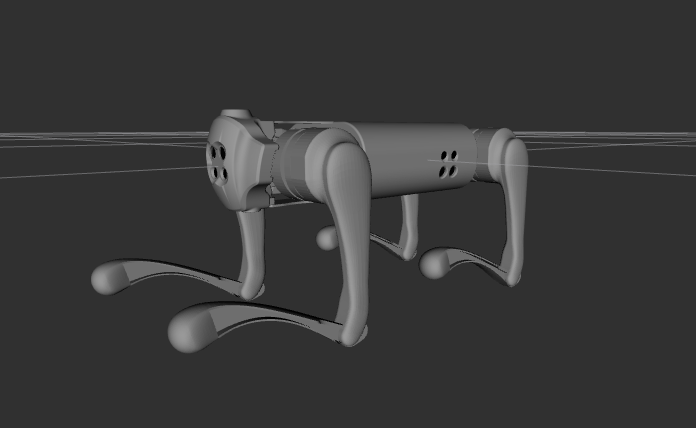

# Sysu219 Description

This repository contains the URDF model of Sysu219.



## Build

```bash
cd ~/ros2_ws
colcon build --packages-up-to sysu219_description  --symlink-install
```

## Visualize the robot

To visualize and check the configuration of the robot in rviz, simply launch:

```bash
source ~/ros2_ws/install/setup.bash
ros2 launch sysu219_description visualize.launch.py
```

## Launch ROS2 Control

### Mujoco Simulator

* Sysu219 Guide Controller
  ```bash
  source ~/ros2_ws/install/setup.bash
  ros2 launch sysu219_guide_controller mujoco.launch.py pkg_description:=sysu219_description
  ```
* OCS2 Quadruped Controller
  ```bash
  source ~/ros2_ws/install/setup.bash
  ros2 launch ocs2_quadruped_controller mujoco.launch.py pkg_description:=sysu219_description
  ```

### Gazebo Classic 11 (ROS2 Humble)

* Sysu219 Guide Controller
  ```bash
  source ~/ros2_ws/install/setup.bash
  ros2 launch sysu219_guide_controller robot_hardware.launch.py pkg_description:=sysu219_description
  ```

### Gazebo Harmonic (ROS2 Jazzy)

* Sysu219 Guide Controller
  ```bash
  source ~/ros2_ws/install/setup.bash
  ros2 launch sysu219_guide_controller gazebo.launch.py pkg_description:=sysu219_description
  ```
